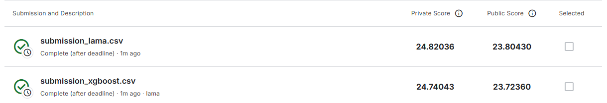
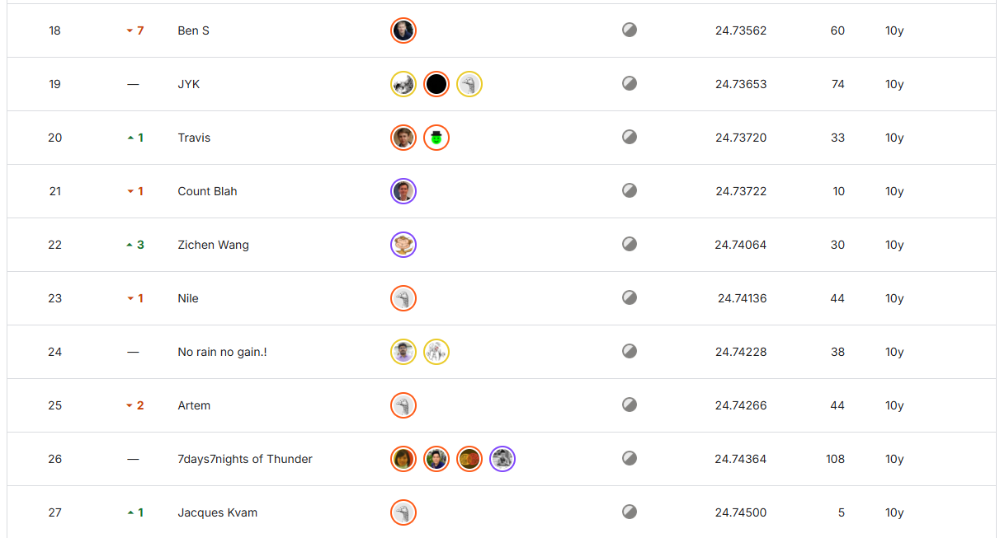

# Решение задачи How Much Did It Rain? II

Задача соревнования - предсказать, сколько выпало дождя в течение часа, используя данные с погодных радаров. Минимизируем метрику MAE

## 1. Анализ таргета (Expected)
**Что сделала:**
Посмотрела, как распределено количество осадков. Построила гистограммы (обычную и в логарифме).

**Выводы:**
*   Распределение сильно скошено (тяжелый правый хвост). Большинство значений - это мелкий дождик или вообще сухо (почти половина данных <= 1 мм).
*   Есть экстремальные выбросы (значения > 30000), скорее всего это ошибки датчиков или штормы.
*   Решила, что учить модель на этих экстремальных выбросах вредно - она начнет хуже предсказывать обычный дождь. Поэтому для обучения я отрезала топ 10% самых больших значений (более подробное объяснение в ноутбуке)

## 2. Анализ признаков
**Что сделала:**
Изучила данные с радаров (`Ref`, `RhoHV`, `Zdr`, `Kdp`). Посмотрела на корреляции и пропуски

**Выводы:**
*   Данные "сырые": для одного часа (Id) может быть от 1 до 19 измерений. Это нужно агрегировать
*   Обнаружила, что `RhoHV` (корреляция) иногда больше 1.0, чего быть не может
*   Линейной связи между признаками и дождем почти нет. Значит, линейные модели тут не справятся, нужны бустинги
*   Много пропусков (NaN), но для радаров это нормально (нет сигнала - нет данных). Бустинги это переваривают, ничего с этим делать не стала

## 3. Предобработка данных
Написала пайплайн из двух классов:
1.  **DataCleaner**: чистит аномалии (клипает `RhoHV`) и убирает выбросы из трейна.
2.  **DataAggregator**: агрегирует кучу строк для одного Id в одну строку.
    *   Считает статистики: среднее, максимум, минимум, разброс (std).
    *   Считает, сколько вообще было замеров и сколько длилось наблюдение.
    *   Считает долю пропусков.

В итоге получаем нормальную таблицу, где одна строка = один час наблюдений.

## 4. Обучение
Данные разбила на трейн и валидацию (80/20). Попробовала несколько подходов.

**Что пробовала:**
1.  **LightAutoML (LAMA)**:
    *   Запустила в режиме "только бустинги" (быстро).
    *   Запустила в режиме "Utilized" (ансамбль, думает дольше).
2.  **Свой XGBoost**:
    *   Настроила пайплайн с `XGBRegressor`.
    *   Гиперпараметры подбирала через Optuna (оптимизировала MAE).

**Результаты:**
LAMA показала себя неплохо, но кастомный XGBoost после тюнинга оказался лучше.
*   XGBoost + Optuna: MAE ≈ **1.69795** (лучший результат).
*   LAMA: MAE получался в районе 1.784.

Еще пробовала CatBoost и LightGBM - результат хуже, чем LAMA (примерно 1.80), поэтому в ноутбук включать не стала.

## 5. Сабмишн
Сделала предсказания для теста.
*   Все отрицательные предсказания заменила на 0 (отрицательного дождя не бывает).
*   Сохранила два варианта в папку `kaggle_submissions`: один от LAMA, другой от XGBoost.

Результат на private leaderboard:

Score = 24.74043 (XGBoost)

В leaderboard это результат 22 места из 588

